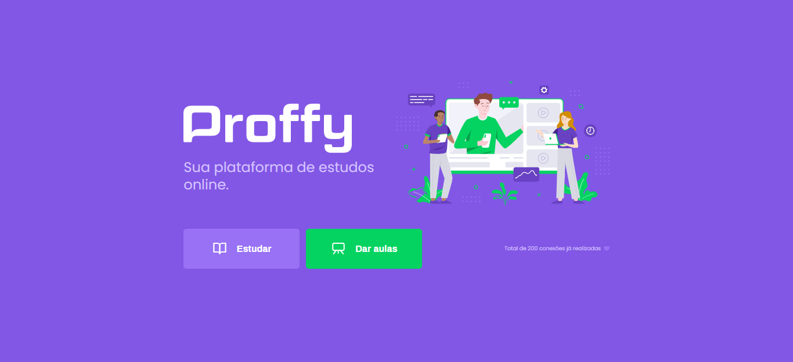

# Proffy

Proffy is an online study platform that connects students to teachers, developed during Next Level Week.

  
  

## Technologys

- [React](https://github.com/facebook/react)
- [Typescript](https://github.com/microsoft/TypeScript)
- [React Router](https://github.com/ReactTraining/react-router)
- [Axios](https://github.com/ReactTraining/react-router)
